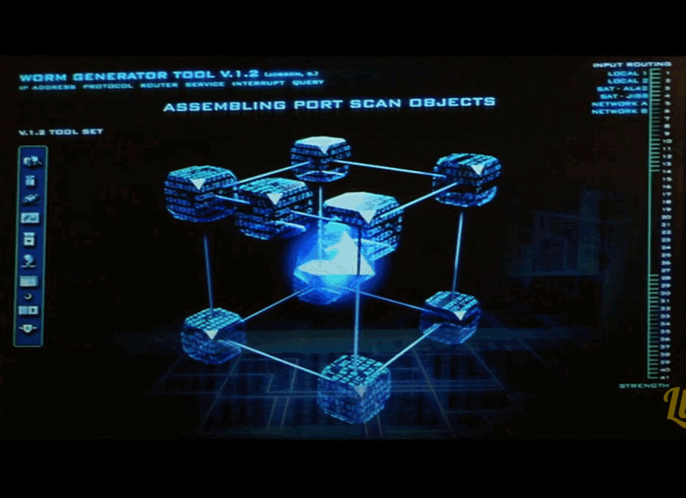
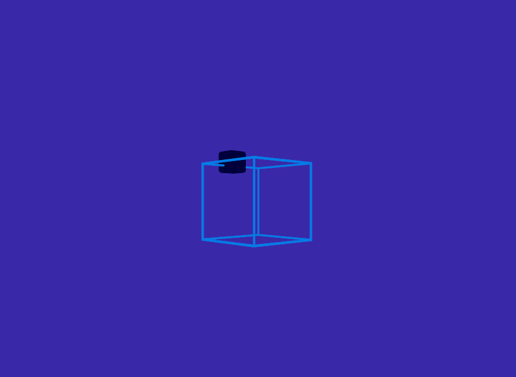

# Swordfish
Build software with 3D status progress like Swordfish movie

  


## Current develoment status

  

# Dependencies
- XDG Shell header
```
wayland-scanner server-header /usr/share/wayland-protocols/stable/xdg-shell/xdg-shell.xml desktop-server.h
```
- vulkan drivers
- vulkan headers
- vulkan validation layers
- Xlib
- C compiler
- Wayland Server development

# To test
    make
    sudo make install

Then in the project directory for building  

    swordfish "command"

Ex:  
    
    swordfish make -j8  
    swordfish ninja  
