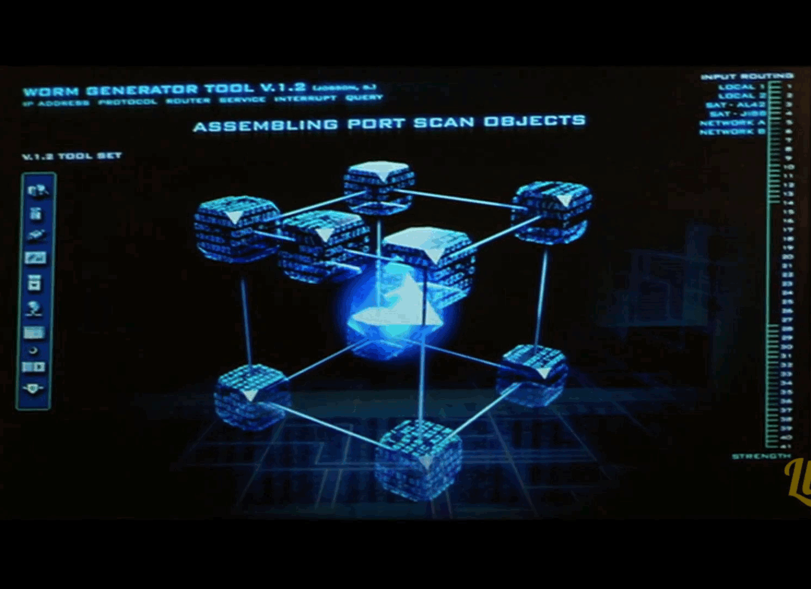
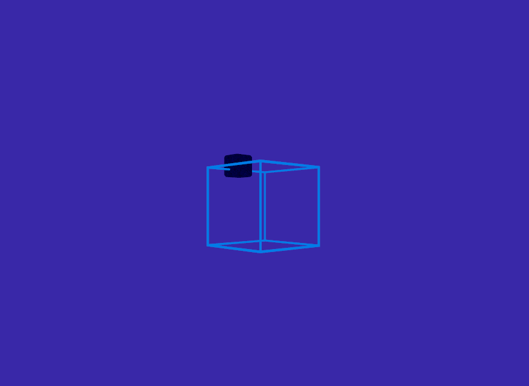

# Swordfish
Build software with 3D status progress like Swordfish movie

  


## Current develoment status

  

Swordfish is one C binary that is three things at once: a **Wayland
compositor**, a **Vulkan renderer** and a small **3D engine**. Client windows
are composited into the 3D world as textured quads, and the machine itself is
the scenery.

What is in the scene right now:

- the CPU as a square die at the centre of the world, one tower per core —
  height is utilisation, colour is temperature
- the running processes as the city around it, height CPU and colour resident
  memory, with towers appearing and disappearing as processes start and exit
- a flat HUD with the numbers the 3D can only suggest
- every connected Wayland client as a quad in the world

It runs two ways: as a **Wayland client** of another compositor (a window
inside sway), or **directly on DRM/KMS** from a tty with no compositor under it
at all. Which one is chosen automatically, by whether a host compositor answers.

The seat carries a keyboard and a pointer. The pointer works out which client
the cursor is over and sends it motion, buttons and scroll, from the host
compositor in a window or from libinput on bare DRM.

Not done yet: resizing (the swapchain is a fixed size), the clipboard, popups
(they are dismissed the moment a client asks for one), `wl_output`, and drawing
a cursor — a client's own cursor image is kept out of the scene rather than
composited, so on the DRM path there is nothing on screen to point with.

# Dependencies

- a C compiler and `make`
- vulkan drivers, headers and validation layers
- `glslc` (shaderc) to compile the GLSL shaders
- wayland-server, wayland-client, wayland-egl and `wayland-scanner`
- libdrm, gbm, EGL/GLESv2
- libinput, libudev, libseat — input and the tty on the DRM path
- xkbcommon
- lodepng (`liblodepng.a`), and the header-only cglm and cgltf
- [pway](https://github.com/oscar0pavon/pway) — the Wayland client library that
  supplies the window. A separate repo, installed to `/usr/local/lib/libpway.a`
  and `/usr/local/include/pway`

There is **no X11**.

The xdg-shell and linux-dmabuf protocol code is generated with
`wayland-scanner` and checked into git, so it does not have to be regenerated
to build. To regenerate it, from inside `source_code/compositor`:

```
./generate_wayland_protocol_files.sh
```

# To test

The repo path is hardcoded in the build, so it has to live at `/root/swordfish`
(and pway at `/root/pway`).

    make
    sudo make install

`make install` is what puts the shaders, models and images under
`/usr/libexec/swordfish`, and they are loaded from there at runtime — a changed
shader does nothing until it is installed again.

Then in the project directory for building  

    swordfish "command"

Ex:  
    
    swordfish make -j8  
    swordfish ninja

Run it with no command and it just shows the machine.

## Keys

Shortcuts are behind super, so everything else goes to the focused client.

| key | |
|---|---|
| `super` + `d` | open a terminal |
| `super` + `q` | quit |
| `super` + `w` | switch to another virtual terminal (DRM only) |
